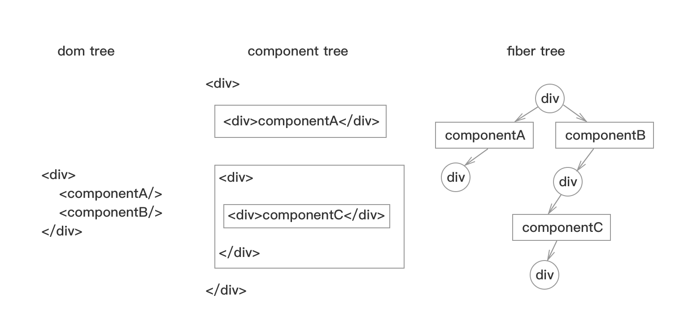

# Error
无论是`render`还是`update`过程，**invokeGuardedCallback**函数调用回调函数`workLoop`，`commitAllHostEffects`, `commitAllLifeCycles`，`performWorkCatchBlock`。
`performWorkCatchBlock`用于在前面三个过程和自己本身中进行错误捕获。


## 流程图
```js
  try{
    workLoop
    commitAllLifeCycles
  }catch{
    while(error)
      performWorkCatchBlock
        boundaryFiber = captureError(errorFiber)
        beginFailWork(boundaryFiber, null)
        completeWork
        commitAllWork
          commitAllHostEffects
            commitAllLifeCycles
  }
```
示例图:   
   
对于图中的结构，`boundaryFiber`为父级ClassComponent，对于componentC的父级，则为componentB
* 如果在componentC的render中报错，即在`workLoop`中出现报错，则相当于放弃componentC, 即componentC为null
* 如果在componentC的componetDidMount中报错，即在`commitAllLifeCycles`中报错，由于已经mount，则还需要unmount   

beginFailWork会为当前的fiber打上错误effectTag，由于componentB的子元素componentC内部报错，会忽略掉错误的componentC，即错误的的componentC为null，执行后续流程，`commitAllLifeCycles`阶段，如果component含有错误的effectTag，则执行componentDidCatch
