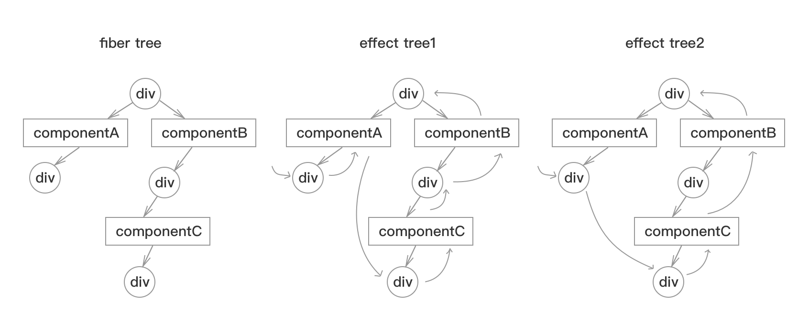

# render
**invokeGuardedCallback**函数调用回调函数`workLoop`，`commitAllHostEffects`, `commitAllLifeCycles`，[`performWorkCatchBlock`](./error.md)进行render过程。

## 流程图
```js
  workLoop
    while {
      叶子节点 = beginWork(父fiber，子fiber) 
      if(!叶子节点){
        while(父fiber) {
          if(子fiber) {
            父fiber = completeWork(子fiber)
            创建effect树() 
            if(父fiber.兄fiber){ 
              父fiber = 父fiber.兄fiber
              break; 
            }
          }
        }
      }
    }
    commitAllWork
      commitAllHostEffects
        commitAllLifeCycles
```

## workLoop
示例图:   
   
图中有3个react对象，componetA，componentB，componentC，componentB包含componentC。   
### 创建fiber树
`beginWork`创建fiber树，深度遍历jsx生成的component树，实例化component后生成对应的fiber树，为所有的子component生成子fiber，直至叶子节点。   
不同的component类型创建对应的fiber节点，fiber节点间形成关联关系，如父子关系，兄弟关系。   
父fiber根据不同的tag，执行不同的component实例化:  
* **ClassComponent**, 实例化react对象, 执行componentWillMount，执行render获取子component并生成子fiber，为componetDidMount和ref打effectTag
* **HostComponent**, 为ref打effectTag，为子component和子component的兄弟生成fiber
* ...

### 创建dom树
`completeWork`沿着`beginWork`遍历的逆序遍历，从子fiber向父fiber遍历，直至某个fiber含有兄弟fiber，如果含有兄弟fiber，则结束当前过程，从兄弟fiber进行`beginWork`过程。   
子fiber根据不同的.tag进行`completeWork`  
* **ClassComponent**，无 
* **HostComponent**, 生成dom，设置attribute，将子fiber和子fiber的兄弟的dom插入到父级dom，创建dom树
* ...

### 创建effect树
**effectTag**，是二进制位构成的标记位，在`beginWork`过程中生成，如instant含有componentDidMount函数，含有ref，会分别打上不同的标记位，供commit过程使用。   
effect树的创建过程沿着`beginWork`遍历的逆序遍历，每一个fiber在`completeWork`后，如果当前fiber含有effectTag，则将当前fiber加入fiber树中。   
effect树的最终结果，就相当于沿着component树做的后序遍历。
   
* **effect tree1**是根据fiber tree生成的完整effect tree，假设所有的fiber都含有effectTag 
* **effect tree2**是根据fiber tree生成的不完整effect tree，假设componentA没有componetDidMount方法，没有ref，componentB的div没有ref，所以不会生成effectTag

## commitAllHostEffects
沿着effect树进行遍历，根据fiber的effectTag的值进行对应的操作。
* **Placement**: 插入操作，将dom树插入container中，页面最终的dom显示完成。

## commitAllLifeCycles
重新沿着effect树进行遍历，根据fiber的effectTag的值进行对应的操作。   
每一个fiber依次进行
1. **commitAttachRef**，处理component上的ref值   
2. **commitLifeCycles**, 执行componentDidMount，处理ref

