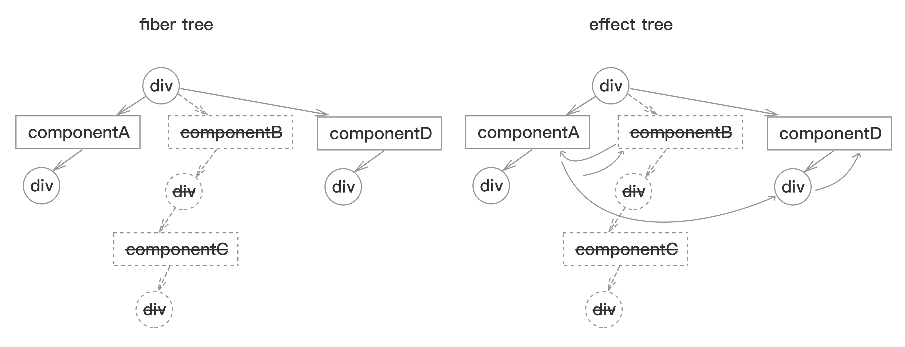

# update
**invokeGuardedCallback**函数调用回调函数`workLoop`，`commitAllHostEffects`, `commitAllLifeCycles`，[`performWorkCatchBlock`](./error.md)进行update过程。   
当某个component执行setState后，会从当前fiber向父fiber遍历，直至根fiber, 设置每个fiber的pendingWorkPriority，标示当前路径需要进行更新。

## 流程图
```js
  workLoop
    while {
      叶子节点 = beginWork(父fiber，子fiber) 
      if(!叶子节点){
        while(父fiber) {
          if(子fiber) {
            父fiber = completeWork(子fiber)
            创建effect树() 
            if(父fiber.兄fiber){ 
              父fiber = 父fiber.兄fiber
              break; 
            }
          }
        }
      }
    }
    commitAllWork
      commitAllHostEffects
        commitAllLifeCycles
```

## workLoop
示例图:   
   
图中为删除componentB，新增componentD。
### 更新fiber树
`beginWork`更新fiber树，深度遍历fiber树，进行更新操作。
父fiber根据不同的tag，执行不同的fiber更新:  
* **ClassComponent**, 执行componentWillReceiveProps，从updateQueue获取新的state值，执行shouldComponentUpdate，执行componentWillUpdate，为componentDidUpdate打effectTag，为ref打effectTag，执行render生成新的子component，进行子component的diff
* **HostComponent**, diff当前fiber的props
  * 如果相同，复制fiber，同时备份子fiber
  * 如果不同，进行子component的diff
* ...

#### 子component的diff过程
老的子component已经存在子fiber，新的component会通过比较key和type，生成新的子fiber，比较过程：
* 子component为新增的，为新的子component生成fiber，同[`render`](./render.md)流程创建fiber树
* 子component为删除的，为子fiber和子fiber的兄弟fiber打上删除effectTag，并加入effect树
* 子fiber和子component同时存在，则进行原位置的更新操作
  * 子component为`非数组`
    * 如果key相同
      * 如果type相同, 复制子fiber，同时备份子fiber
      * 如果type不同，为子fiber和子fiber的兄弟fiber打上删除effectTag，将它们加入effect树，为新的子component生成fiber，打上插入effectTag，同[`render`](./render.md)流程创建fiber树
    * 如果key不同，为子fiber和子fiber的兄弟fiber打上删除effectTag，将它们加入effect树，为新的子component生成fiber，同[`render`](./render.md)流程创建fiber树
  * 子component为`数组`，则子fiber和子component按照数组顺序进行比较
    * 如果key相同，
      * 如果type相同, 复制子fiber，同时备份子fiber
      * 如果type不同，为该子fiber打上删除effectTag，将它加入effect树，为新的子component生成fiber，为新的fiber打上插入effectTag
    * 如果key不同，则结束当前数组顺序遍历，把剩余的子fiber的兄弟以key或者index为key暂存在map中，将剩余子component的key和index为key，以数组顺序与暂存map中的子fiber对比，执行已以下流程后，如果map中还有未删除的子fiber，为该子fiber打上删除effectTag，将他们加入effect树
      * 如果map中存在
        * 如果type相同，复制子fiber，同时备份子fiber，把map中的子fiber删除
        * 如果type不同，则为新的子component生成fiber
      * 如果map中不存在，为新的子component生成fiber，为新的fiber打上插入effectTag    

### 更新dom树
`completeWork`沿着`beginWork`遍历的逆序遍历，从子fiber向父fiber遍历，直至某个fiber含有兄弟fiber，如果含有兄弟fiber，则结束当前过程，从兄弟fiber进行`beginWork`过程。   
如果该子fiber为新增加的，则按照[`render`](./render.md)过程操作，   
* 子component含有兄弟component
如果该子fiber只是更新，则根据不同的.tag进行`completeWork`  
* **ClassComponent**，无 
* **HostComponent**, 更新fiber的props，对比props，打上更新effectTag
* ...

### 更新effect树
在由删除的fiber组成的effect树上挂上新增加的fiber, 构成新的fiber树
   

## commitAllHostEffects
沿着effect树进行遍历，detatchRef，根据effectTag进行
* **Placement**: 插入操作，新增加的fiber执行同[`render`](./render.md)
* **Deletion**: 删除操作，从删除fiber开始进行深度遍历，按照fiber的tag进行删除操作:
  * **ClassComponent**:删除ref，执行componentWillUnmount
  * **HostComponent**: 删除ref，从父dom删除子dom
  * ...
* **PlacementAndUpdate**: 插入操作后，更新操作
* **Update**: 更新操作
  * **HostComponent**: 更新dom的attributre,设置content

## commitAllLifeCycles
重新沿着effect树进行遍历，根据fiber的effectTag的值进行对应的操作。   
如果是新fiber，则执行[`render`](./render.md)过程的操作，如果是老的fiber，每一个fiber依次进行
1. **commitAttachRef**，处理component上的ref值   
2. **commitLifeCycles**, 
  * **ClassComponent**: 执行componentDidUpdate，执行setState回调
  * **HostComponent**: 如有focus，执行focus操作, 处理ref
  * ...
